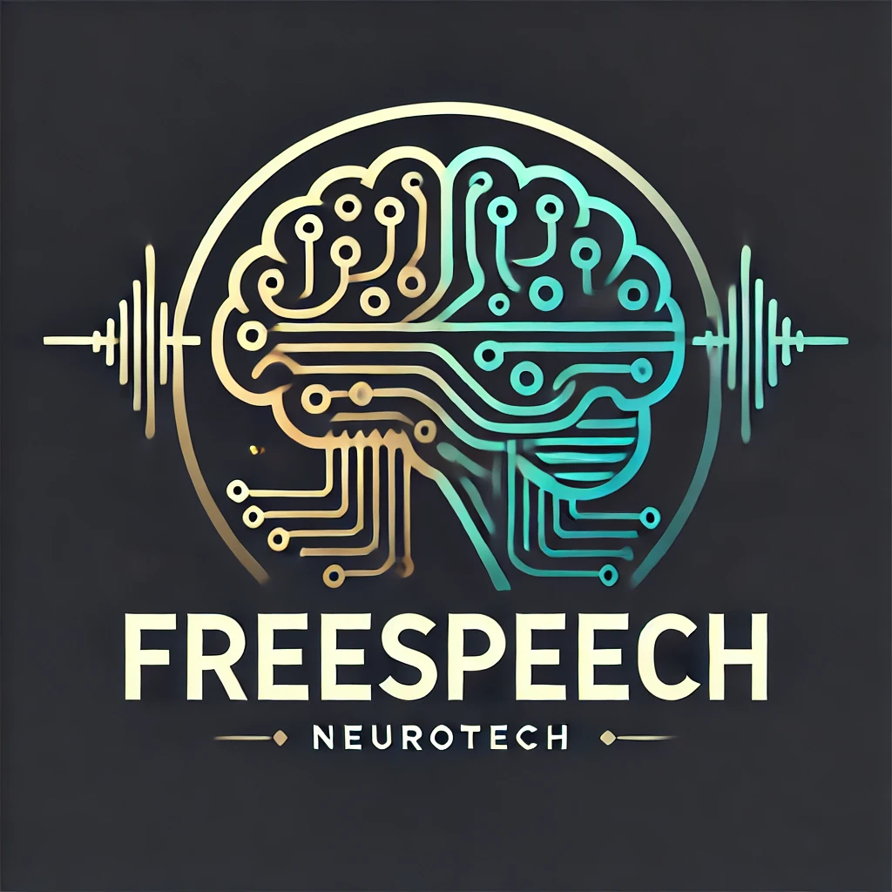

# FreeSpeech



### Our project created for NatHacks 2024: FreeSpeech  
**Giving individuals the ability to talk without talking!**

---

## Overview
FreeSpeech is an innovative app developed for NatHacks 2024 that harnesses EEG data from a Muse2 headset. It processes EEG motor signals using signal processing techniques such as Butterworth Band Filtering to seperate EEG waves into Delta, Beta, Theta, Alpha, and Gamma. We then use machine learning models such as Random Forest and XGBoosting to determine if the users is thinking "left," "right," or "blinking." These inputs control a **Tkinter-based GUI**, allowing users to select corresponding letters and craft messages.

---

## Requirements

1. **Petal Metrics Software**  
   Ensure that the Petal Metrics software is installed, as it streams EEG data from the Muse2 headset.

2. **Muselsl Library**  
   Install the `muselsl` library to stream and analyze EEG data from the Muse headset. You can install it using:
   ```bash
   pip install muselsl


## Running the Application

1. Connect the Muse2 headset to the **Petal Metrics** software.
2. Navigate to `test_gui/main.py`.
3. Run the application:
   ```bash
   python main.py


### Use the Following Controls:

- **Blink**: Select/Enter.  
- **Think "left"**: Move left.  
- **Think "right"**: Move right.  

Continue navigating until you form your desired word!

---

### Compatibility

To use this application, ensure you have access to a **Muse2 headset**.

